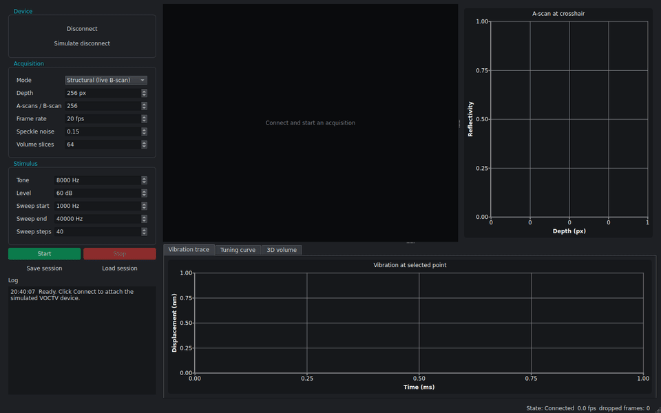
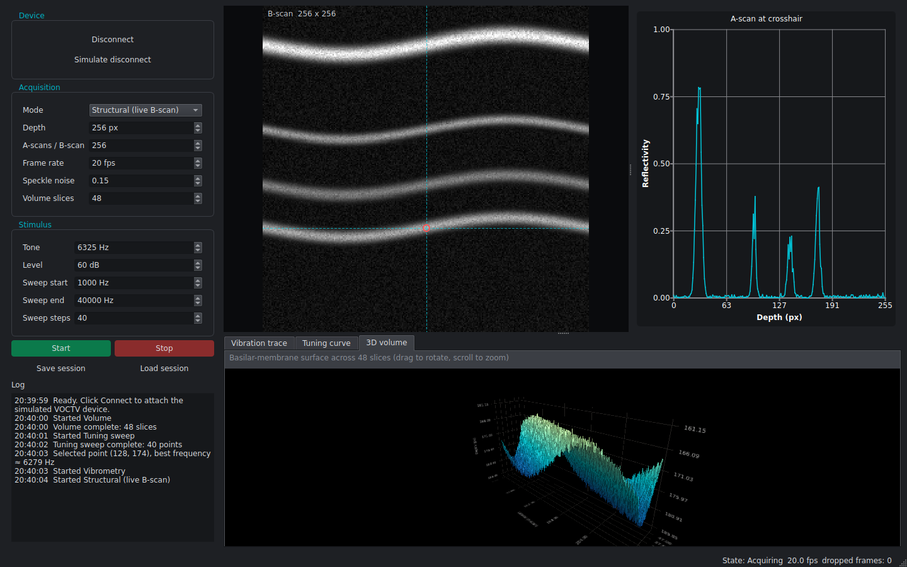

# VOCTV Console

[](https://github.com/saatviknagpal/voctv-console/actions/workflows/ci.yml)

A C++17 / Qt 6 desktop app that simulates a **Volumetric Optical Coherence Tomography and Vibrometry (VOCTV)** acquisition system for cochlear imaging. It controls a (simulated) device, receives data on a worker thread, and visualizes it live in 2D and 3D.



## What it does
- **Structural imaging:** live B-scans (cross-sections) showing four tissue layers (bone, Reissner's membrane, tectorial membrane, basilar membrane) with speckle noise, plus the A-scan (depth profile) at the crosshair.
- **Volume:** captures a stack of B-scans, extracts the basilar-membrane surface from each slice and renders it in 3D (drag to rotate, scroll to zoom).
- **Vibrometry:** click a point on the B-scan, play a virtual tone and watch its displacement (nm) over time.
- **Tuning sweep:** steps the tone frequency and plots the tuning curve. Each cochlear position responds best to one frequency (tonotopy), with high frequencies at the base and low frequencies at the apex.
- **Sessions:** save and load to `session.json` + `volume.bin` + `vibration.bin`. Corrupt or truncated files give a clear error and leave the current session untouched.
- **Fault handling:** "Simulate disconnect" injects a device fault; acquisition stops and the UI returns to a safe state.



## Architecture
```
MainWindow (GUI thread)
   │  commands (queued)             ▲ frames / chunks / points (queued)
   ▼                                │
AcquisitionController ── owns ──► QThread ──► IDevice  (SimulatedVoctvDevice ← TissueModel)
   │
DataStore (session state, 3D surface extraction, save/load)
```
- **`IDevice` is the only contract the app depends on.** Supporting real hardware means adding one `IDevice` subclass that wraps the vendor SDK and emits the same signals. Nothing else changes.
- **The UI never blocks.** The device lives on its own `QThread`, and every command crosses threads as a queued call. Shutdown stops acquisition, then quits and joins the thread before anything is destroyed.
- **Back-pressure.** In live modes, B-scans are coalesced (latest frame wins, drops are counted in the status bar), so a slow display never backs up the device. In Volume mode every slice is delivered in order, because each one is part of the 3D volume.
- **`TissueModel`** is pure and deterministic for a given seed: layered reflectivity with depth attenuation and speckle, and a resonance model (Q = 6) whose best frequency depends on position along the cochlea.

## Build and run (Ubuntu 24.04, or WSL on Windows)
```bash
sudo apt install build-essential cmake ninja-build qt6-base-dev qt6-charts-dev \
    qt6-datavisualization-dev qt6-declarative-dev libgl1-mesa-dev libxkbcommon-dev
./scripts/build.sh          # configure, build, run all tests
./build/voctv-console
```
- `./scripts/package.sh` produces `voctv-console-linux-x86_64.tar.gz`.
- `./scripts/demo.sh` runs a scripted demo on a virtual display (needs `xvfb ffmpeg`) and regenerates `docs/screenshot.png` and `docs/demo.gif`.
- `voctv-console --screenshot out.png` and `--capture-frames dir/` run the same scripted demo from the command line.

## Tests
Five Qt Test suites run under CTest and in CI on every push. They cover:
- parameter validation
- the tissue model: layer depths, determinism and the tuning-curve peak
- the device: modes, double start, start before connect, faults
- the controller: frames arrive on the GUI thread, start/stop cycles, destruction mid-acquisition, frame coalescing, live reconfiguration, and lossless in-order volume delivery
- session persistence: round-trip, plus corrupt and truncated files

```bash
ctest --test-dir build --output-on-failure
```

## Project layout
```
src/core     Types (params, frames, validation), TissueModel
src/device   IDevice interface, SimulatedVoctvDevice
src/app      AcquisitionController (worker thread, frame coalescing)
src/data     DataStore (session state, layer surface, save/load)
src/ui       MainWindow, BScanView, plots (Qt Charts), VolumeView (Qt DataVisualization)
tests        Qt Test suites
```

## Notes
Simulated data only. The tissue and vibration models are simplified for demonstration and are not physiologically calibrated.
